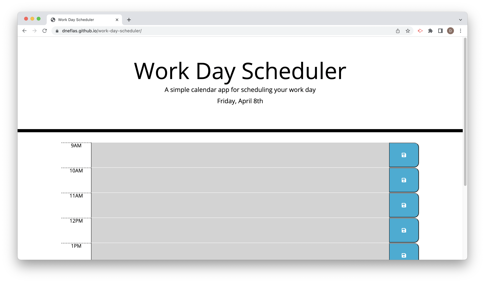

# Work Day Scheduler

## Description
Work Day Scheduler is a daily planner application. It features color-coded time blocks for every hour that indicate whether the time is in the past, present, or future. Helping people with busy schedules manage time more effectively. This application was built to practice the use of third-party APIs, web APIs, and JavaScript.

## Technologies Used
- HTML
- CSS
- Javascript
- JQuery
- Bootstrap
- Fontawesome
- Google Fonts
- Moment.js

## Deployed Application

https://dneflas.github.io/work-day-scheduler/
